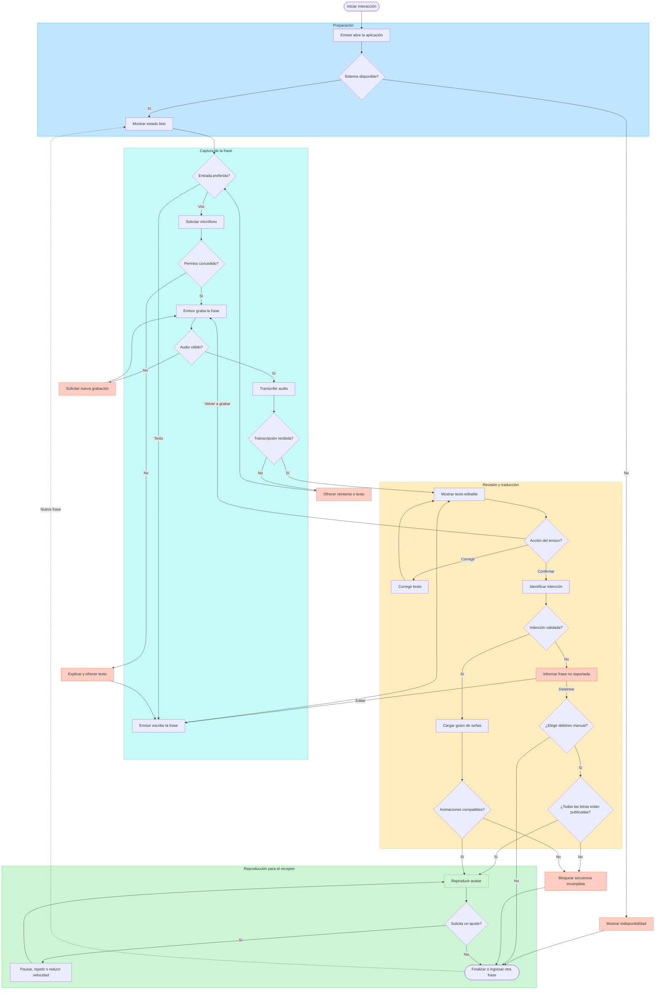

# Personas y escenarios

**Estado:** Borrador

Las personas son hipótesis de diseño, no perfiles demográficos definitivos.

## Persona A: emisor hispanohablante

**Objetivo:** expresar rápidamente una intención cotidiana a una persona usuaria
de LSC.
**Contexto:** dispone de un teléfono o computador con micrófono e internet.
**Necesidades:** operación simple, confirmación del texto y respuesta rápida.
**Riesgos:** ruido, pronunciación, frase no soportada o confianza excesiva en la
traducción.

## Persona B: receptor usuario de LSC

**Objetivo:** comprender la intención sin depender del texto en español.
**Contexto:** observa la pantalla compartida.
**Necesidades:** manos visibles, ritmo adecuado, expresiones faciales, posibilidad
de repetir y encuadre estable.
**Riesgos:** seña regional incorrecta, transición confusa o avatar poco legible.

## Persona C: propietario del producto

**Objetivo:** incorporar y corregir intenciones, reglas y animaciones sin modificar todo
el sistema.
**Necesidades:** catálogo trazable, nombres consistentes, pruebas automatizadas y
documentación breve.

## Escenario principal

1. El emisor abre la aplicación.
2. Presiona el control de grabación y dice: “Buenos días”.
3. La aplicación presenta la transcripción.
4. El emisor confirma o corrige el texto.
5. El sistema reconoce la intención `SALUDO_BUENOS_DIAS`.
6. El avatar reproduce el guion validado.
7. El receptor puede solicitar repetirlo o verlo más lento.

## Diagrama de flujo detallado

El diagrama representa el recorrido completo de una interacción. Las decisiones
rojas conducen a una recuperación segura; la reproducción verde solo se alcanza
cuando la intención y todos sus recursos están validados.

### Responsabilidad durante el flujo

| Participante | Responsabilidad observable |
|---|---|
| Emisor hispanohablante | Elegir la entrada, hablar o escribir, revisar y confirmar el texto. |
| Sistema | Transcribir, clasificar, comprobar el catálogo y controlar el avatar. |
| Receptor usuario de LSC | Observar la animación y solicitar pausa, repetición o menor velocidad. |
| Propietario del producto | Corregir fuera de la interacción los errores de catálogo o animaciones faltantes. |

El receptor no tiene que declarar al sistema si comprendió. Esa respuesta se
recoge únicamente durante las pruebas de comprensión descritas en el protocolo
de validación LSC.

## Escenarios alternativos

### Frase no soportada

El sistema informa que aún no puede traducirla y ofrece mostrar el texto. No
compone una secuencia aproximada. El emisor puede editar, cancelar o confirmar
un deletreo manual identificado claramente como español deletreado y no como
traducción LSC.

### Transcripción incorrecta

El emisor corrige el texto antes de traducir o vuelve a grabar.

### Fallo de red o transcripción

El audio no queda en un estado indefinido. Se muestra un error recuperable y se
permite escribir la frase.

### Animación faltante

El sistema bloquea la reproducción de la intención incompleta y registra el
identificador faltante durante desarrollo.

## Preguntas abiertas

- ¿En qué espacio real se probará primero: comercio, universidad, oficina u hogar?
- ¿El receptor controlará directamente repetición y velocidad?
- ¿Se necesita mostrar simultáneamente español escrito?
