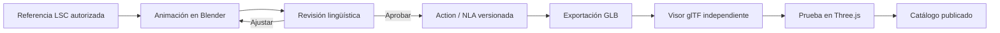

# Pipeline Blender → GLB → aplicación

**Versión:** 0.1
**Estado:** Borrador técnico

## Flujo



## Archivo fuente

Estructura propuesta:

```text
assets/
├── blender/
│   ├── avatar-v1.blend
│   └── referencias/
├── exports/
│   └── avatar-v1.glb
└── catalog/
    ├── signs.json
    └── intents.json
```

Los archivos Blender y GLB se incorporarán cuando existan. Las referencias deben
tener origen y permiso de uso registrados.

## Preparación en Blender

1. Trabajar con el rig `avatar-v1` sin renombrar huesos.
2. Crear una Action con la convención acordada.
3. Incluir la Action en el mecanismo que el exportador glTF vaya a exportar.
4. Revisar el rango, pose inicial, pose final y shape keys.
5. Aplicar u hornear restricciones no compatibles.
6. Guardar una nueva versión antes de cambios destructivos.

## Perfil de exportación inicial

- Formato: glTF Binary (`.glb`).
- Incluir: mesh, armature, skinning, animaciones y shape keys requeridas.
- Excluir: cámaras, luces y objetos de control que no use la aplicación.
- Exportar huesos de deformación y dependencias necesarias.
- Muestrear animaciones si las restricciones o drivers lo requieren.
- Compresión de texturas y geometría: decidir después de medir calidad y peso.

## Verificación después de exportar

- Abrir el archivo en un visor glTF independiente.
- Enumerar los nombres de `AnimationClip`.
- Reproducir cada clip individualmente.
- Verificar pose neutral, manos, rostro, materiales y escala.
- Cargarlo con el reproductor real y probar crossfades.
- Registrar peso, tiempo de carga y FPS.

## Criterio de salida del Sprint 0

Un GLB contiene pose neutral y tres clips de prueba, se reproduce en un navegador
y conserva movimientos de dedos y al menos un componente facial.
