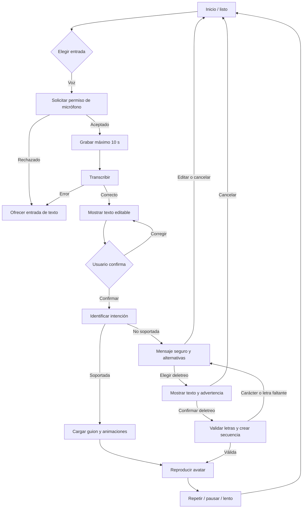

# Flujo de usuario

**Estado:** Borrador

## Flujo principal por voz

## Flujo principal por texto

1. Escribir una frase.
2. Confirmar la frase.
3. Identificar la intención.
4. Reproducir el guion si está validado.
5. Si no está soportado, permitir editar, cancelar o elegir deletreo manual.
6. Confirmar el texto exacto antes de generar la secuencia de letras.

## Estados visibles

| Estado | Mensaje sugerido | Acción disponible |
|---|---|---|
| LISTO | “Escribe o mantén presionado para hablar.” | Escribir, grabar |
| GRABANDO | “Escuchando…” | Detener, cancelar |
| TRANSCRIBIENDO | “Convirtiendo voz en texto…” | Cancelar |
| REVISANDO | “Confirma lo que entendimos.” | Editar, repetir |
| TRADUCIENDO | “Preparando la traducción…” | Cancelar |
| CARGANDO | “Cargando el avatar…” | Esperar, reintentar |
| REPRODUCIENDO | “Reproduciendo LSC.” | Pausar, repetir, lento |
| NO_SOPORTADA | “Esta expresión aún no tiene traducción validada.” | Editar, ver opciones, deletrear |
| CONFIRMANDO_DELETREO | “Esto deletrea el español; no es una traducción a LSC.” | Confirmar, cancelar |
| DELETREANDO | “Reproduciendo deletreo manual.” | Pausar, repetir, lento |
| ERROR | Mensaje específico y recuperable. | Reintentar, usar texto |

## Principios de interacción

- El usuario siempre ve y puede corregir la transcripción.
- El sistema no reproduce resultados parciales como si estuvieran validados.
- Cada error ofrece una siguiente acción.
- La animación no comienza hasta que el avatar y el guion están listos.
- No se muestran porcentajes de “confianza de traducción” que puedan inducir una
  falsa sensación de precisión.
- El deletreo nunca se activa sin una elección y confirmación del usuario.
