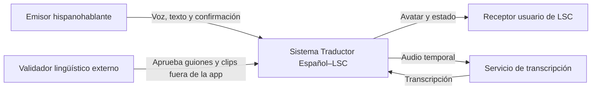
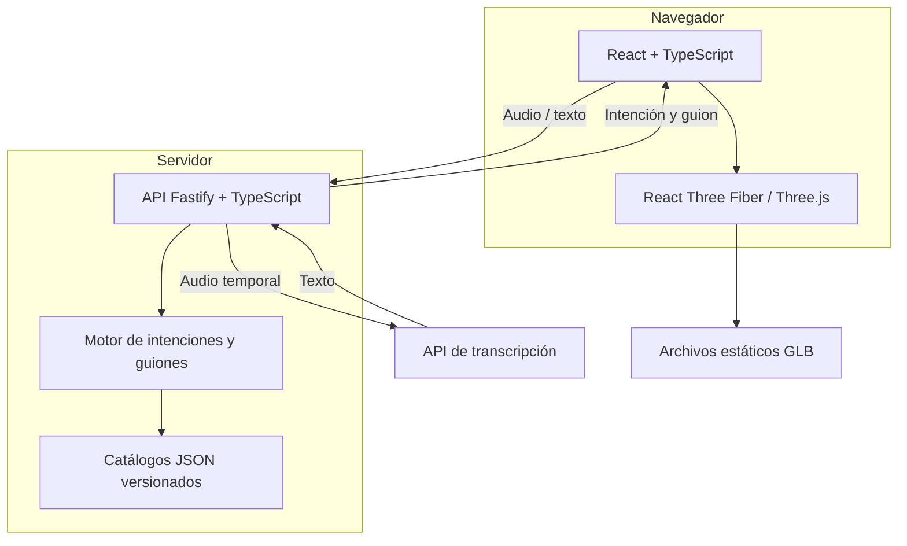

# Arquitectura C4

**Versión:** 0.1
**Estado:** Propuesta

## Nivel 1: contexto

## Nivel 2: contenedores

## Responsabilidades

### Aplicación web

- Solicitar permiso y capturar audio.
- Mostrar transcripción editable.
- Gestionar estados de la interacción.
- Cargar el avatar y reproducir el guion.
- No contener claves privadas.

### Backend API

- Validar tamaño, formato y duración del audio.
- Proteger la clave del proveedor STT.
- Normalizar texto de forma limitada.
- Clasificar intenciones soportadas.
- Entregar únicamente guiones publicados.
- Eliminar audio temporal y emitir errores seguros.

### Motor de traducción

- Operar de manera determinista sobre el catálogo aprobado.
- Distinguir intención soportada de entrada desconocida.
- Verificar compatibilidad entre guion, clips y rig.
- No generar libremente secuencias de LSC.

### Catálogos

- Ser la fuente de verdad de intenciones, guiones y clips.
- Mantener versión, estado y trazabilidad lingüística.
- Permanecer como JSON durante el MVP.

## Despliegue inicial

Una aplicación web estática y una API Node desplegada como un único servicio o
dos servicios simples. Los GLB pueden servirse como archivos estáticos. No se
incorporan colas, microservicios, almacenamiento de objetos ni base de datos hasta
que una necesidad medida lo justifique.

## Límites de confianza

- Navegador: entrada no confiable.
- Backend: único lugar con secretos.
- Proveedor STT: tercero que procesa audio bajo sus términos.
- Catálogo publicado: contenido confiable solo después de validación.
