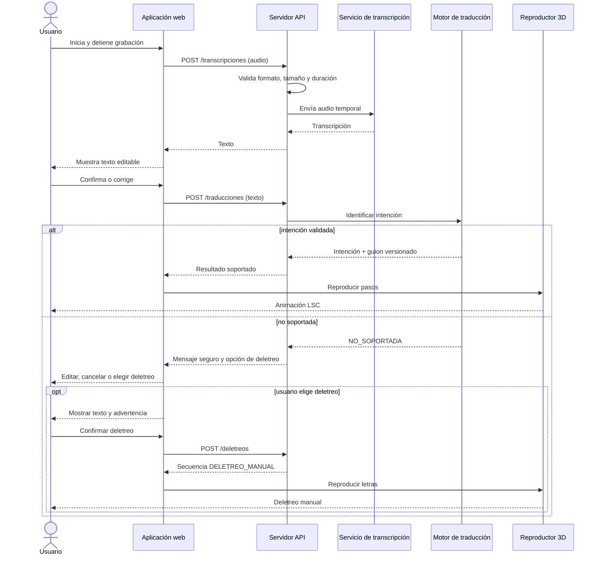
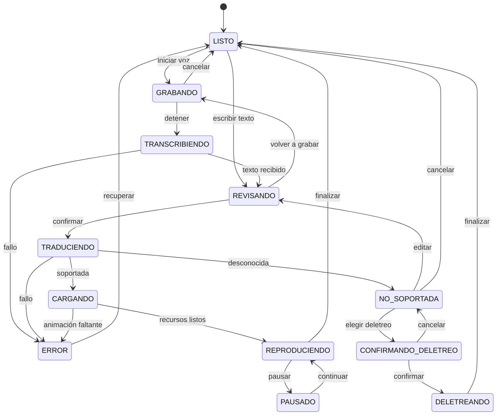
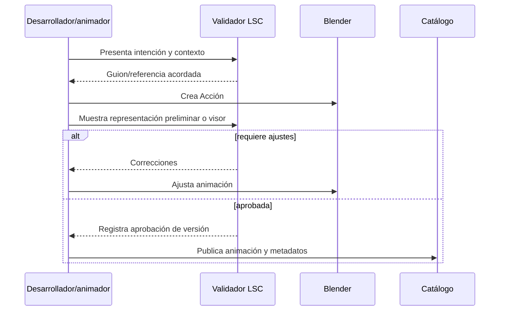

# Diagramas de secuencia y estados

**Estado:** Propuesta

## Secuencia de voz a avatar

```mermaid
sequenceDiagram
    actor U as Usuario
    participant W as Aplicación web
    participant A as Servidor API
    participant S as Servicio de transcripción
    participant T as Motor de traducción
    participant P as Reproductor 3D

    U->>W: Inicia y detiene grabación
    W->>A: POST /transcripciones (audio)
    A->>A: Valida formato, tamaño y duración
    A->>S: Envía audio temporal
    S-->>A: Transcripción
    A-->>W: Texto
    W-->>U: Muestra texto editable
    U->>W: Confirma o corrige
    W->>A: POST /traducciones (texto)
    A->>T: Identificar intención
    alt intención validada
        T-->>A: Intención + guion versionado
        A-->>W: Resultado soportado
        W->>P: Reproducir pasos
        P-->>U: Animación LSC
    else no soportada
        T-->>A: NO_SOPORTADA
        A-->>W: Mensaje seguro y opción de deletreo
        W-->>U: Editar, cancelar o elegir deletreo
        opt usuario elige deletreo
            W-->>U: Mostrar texto y advertencia
            U->>W: Confirmar deletreo
            W->>A: POST /deletreos
            A-->>W: Secuencia DELETREO_MANUAL
            W->>P: Reproducir letras
            P-->>U: Deletreo manual
        end
    end
```

## Máquina de estados de la interfaz

```mermaid
stateDiagram-v2
    [*] --> LISTO
    LISTO --> GRABANDO: iniciar voz
    LISTO --> REVISANDO: escribir texto
    GRABANDO --> TRANSCRIBIENDO: detener
    GRABANDO --> LISTO: cancelar
    TRANSCRIBIENDO --> REVISANDO: texto recibido
    TRANSCRIBIENDO --> ERROR: fallo
    REVISANDO --> TRADUCIENDO: confirmar
    REVISANDO --> GRABANDO: volver a grabar
    TRADUCIENDO --> CARGANDO: soportada
    TRADUCIENDO --> NO_SOPORTADA: desconocida
    NO_SOPORTADA --> CONFIRMANDO_DELETREO: elegir deletreo
    CONFIRMANDO_DELETREO --> DELETREANDO: confirmar
    CONFIRMANDO_DELETREO --> NO_SOPORTADA: cancelar
    DELETREANDO --> LISTO: finalizar
    TRADUCIENDO --> ERROR: fallo
    CARGANDO --> REPRODUCIENDO: recursos listos
    CARGANDO --> ERROR: animación faltante
    REPRODUCIENDO --> PAUSADO: pausar
    PAUSADO --> REPRODUCIENDO: continuar
    REPRODUCIENDO --> LISTO: finalizar
    NO_SOPORTADA --> REVISANDO: editar
    NO_SOPORTADA --> LISTO: cancelar
    ERROR --> LISTO: recuperar
```

## Secuencia de publicación de una seña

```mermaid
sequenceDiagram
    participant D as Desarrollador/animador
    participant V as Validador LSC
    participant B as Blender
    participant C as Catálogo

    D->>V: Presenta intención y contexto
    V-->>D: Guion/referencia acordada
    D->>B: Crea Acción
    D->>V: Muestra representación preliminar o visor
    alt requiere ajustes
        V-->>D: Correcciones
        D->>B: Ajusta animación
    else aprobada
        V-->>D: Registra aprobación de versión
        D->>C: Publica animación y metadatos
    end
```
