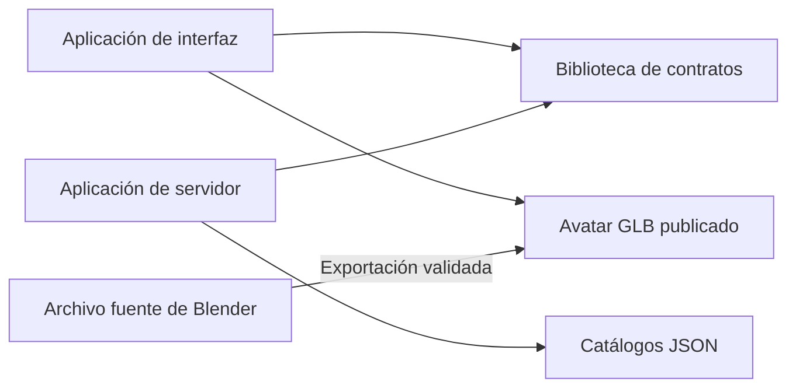

# Estructura del proyecto

**Estado:** Propuesta para iniciar la implementación

## Objetivo

Definir dónde se ubicará cada responsabilidad técnica de NexoLSC antes de crear
código. La estructura favorece un repositorio único, nombres en español y una
separación clara entre interfaz, servidor, contratos, catálogos y recursos 3D.

## Estructura propuesta

El árbol representa la estructura objetivo del PMV. Las carpetas se crearán solo
cuando contengan su primera responsabilidad real; no se agregarán directorios
vacíos por anticipado.

```text
NexoLSC/
├── aplicaciones/
│   ├── interfaz/
│   │   ├── codigo/
│   │   │   ├── componentes/
│   │   │   ├── caracteristicas/
│   │   │   │   ├── entrada/
│   │   │   │   ├── transcripcion/
│   │   │   │   ├── traduccion/
│   │   │   │   └── avatar/
│   │   │   ├── servicios/
│   │   │   ├── estado/
│   │   │   └── tipos/
│   │   ├── publico/
│   │   │   └── modelos/
│   │   │       └── avatar-v1.glb
│   │   └── pruebas/
│   └── servidor/
│       ├── codigo/
│       │   ├── rutas/
│       │   ├── servicios/
│       │   ├── dominio/
│       │   │   ├── intenciones/
│       │   │   ├── guiones/
│       │   │   └── deletreo/
│       │   ├── integraciones/
│       │   │   └── transcripcion/
│       │   ├── esquemas/
│       │   └── configuracion/
│       └── pruebas/
├── bibliotecas/
│   └── contratos/
├── catalogos/
│   ├── intenciones.json
│   ├── guiones.json
│   └── animaciones.json
├── recursos/
│   └── blender/
│       ├── avatar-v1.blend
│       └── referencias/
├── pruebas/
│   └── extremo-a-extremo/
├── docs/
├── CAMBIOS.md
├── CONTRIBUIR.md
├── README.md
├── package.json
└── tsconfig.base.json
```

`package.json`, `tsconfig.base.json` y `README.md` conservan sus nombres porque
son archivos técnicos reconocidos por las herramientas empleadas.

## Responsabilidad de cada directorio

| Directorio | Responsabilidad |
|---|---|
| `aplicaciones/interfaz` | Captura voz o texto, permite corregir la transcripción y presenta el avatar. |
| `aplicaciones/interfaz/codigo/caracteristicas/avatar` | Carga el GLB, selecciona animaciones por identificador y controla reproducción, pausa y velocidad. |
| `aplicaciones/servidor` | Protege secretos, recibe audio, solicita la transcripción y resuelve intenciones, guiones y secuencias de deletreo confirmadas. |
| `bibliotecas/contratos` | Define en TypeScript las entradas y respuestas compartidas por interfaz y servidor. |
| `catalogos` | Conserva los datos JSON versionados y validados de intenciones, guiones y animaciones. |
| `recursos/blender` | Conserva el archivo fuente del avatar y las referencias con permiso de uso. |
| `aplicaciones/interfaz/publico/modelos` | Contiene el GLB exportado que descargará el navegador. |
| `pruebas/extremo-a-extremo` | Verifica recorridos completos de texto o voz hasta la reproducción del avatar. |
| `docs` | Conserva requisitos, decisiones, diseño, lingüística, animación, gestión y calidad. |

## Dependencias permitidas



- La interfaz no importa módulos internos del servidor.
- El servidor no depende de componentes visuales de la interfaz.
- Los contratos no contienen reglas de negocio ni acceso a servicios externos.
- Los catálogos no contienen secretos ni código ejecutable.
- El GLB publicado proviene de una versión validada del archivo Blender.

## Recorrido de una solicitud

1. `entrada` captura voz o texto.
2. `transcripcion` envía el audio al servidor y recibe texto.
3. El usuario confirma o corrige el texto.
4. `traduccion` solicita una intención y un guion validados.
5. `avatar` carga `avatar-v1.glb` y reproduce las animaciones indicadas por el
   guion.

## Reglas para mantener la estructura simple

- No crear una biblioteca compartida hasta que exista un contrato usado por ambas
  aplicaciones.
- No agregar base de datos durante el PMV; los catálogos JSON son suficientes.
- No crear microservicios: el servidor contiene transcripción y traducción como
  módulos internos.
- Cada característica debe conservar juntos sus componentes, lógica y pruebas
  específicas.
- Una carpeta nueva debe representar una responsabilidad real, no una posible
  necesidad futura.
