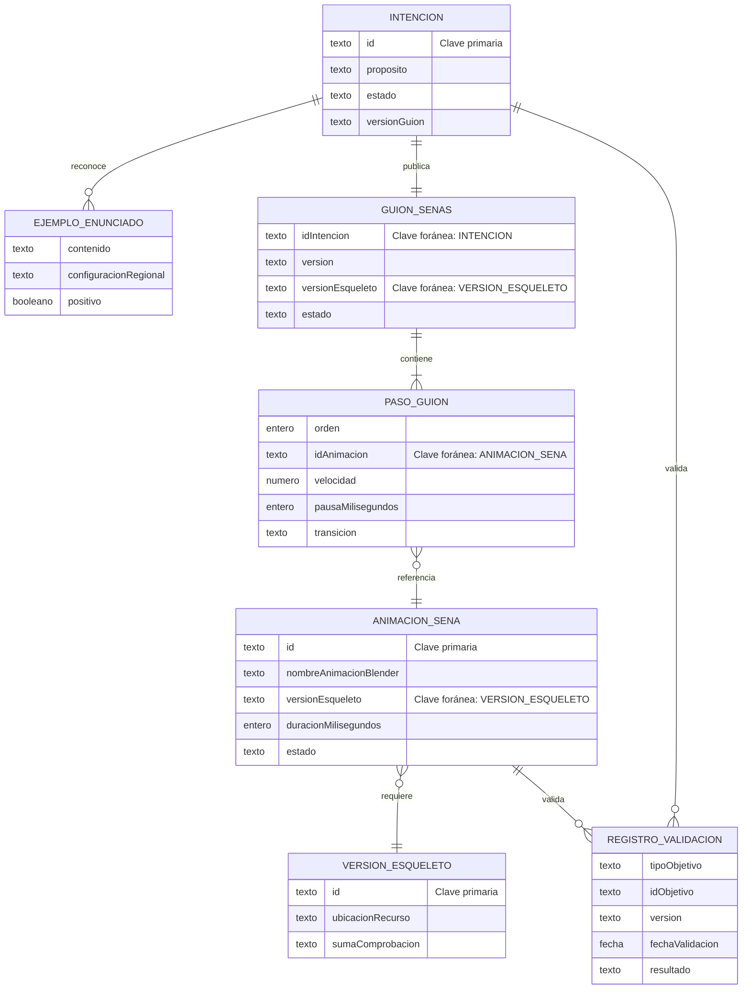

# Modelo de datos

**Versión:** 0.2
**Estado:** Propuesta conceptual

## Convenciones

- Los nombres de entidades, relaciones y atributos están en español.
- Los identificadores técnicos omiten tildes y la letra `ñ` para facilitar su uso
  posterior en código y archivos JSON.
- Las claves se describen en español dentro del diagrama.
- Los tiempos expresados en milisegundos utilizan el sufijo `Milisegundos`.

## Relaciones



## Ejemplo de intención

```json
{
  "id": "CORTESIA_GRACIAS",
  "proposito": "Expresar agradecimiento",
  "configuracionRegional": "es-CO",
  "estado": "PROPUESTA",
  "ejemplos": {
    "positivos": ["gracias", "muchas gracias"],
    "negativos": ["no gracias"]
  },
  "versionGuion": null
}
```

## Ejemplo de guion

```json
{
  "idIntencion": "CORTESIA_GRACIAS",
  "version": "0.1.0",
  "versionEsqueleto": "avatar-v1",
  "estado": "PROPUESTA",
  "pasos": [
    {
      "orden": 1,
      "idAnimacion": "LSC_CORTESIA_GRACIAS_V1",
      "velocidad": 1,
      "pausaMilisegundos": 100,
      "transicion": "NEUTRAL_A_SENA"
    }
  ]
}
```

Los valores lingüísticos del ejemplo no están validados.

## Reglas de integridad

- Un guion publicado referencia únicamente animaciones publicadas.
- Todas las animaciones de un guion usan el mismo valor de `versionEsqueleto`.
- Los identificadores y versiones son inmutables después de publicación.
- Los registros de validación no contienen datos personales innecesarios.
- La suma de comprobación del GLB permite verificar que se probó el mismo recurso
  publicado.
