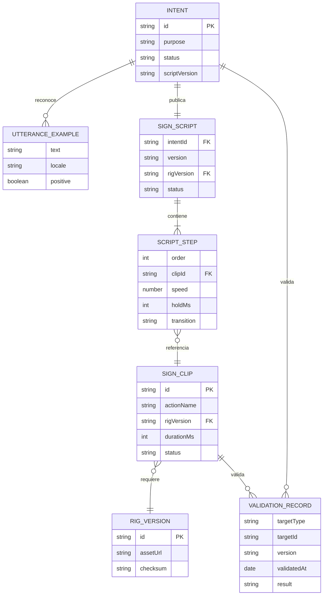

# Modelo de datos

**Versión:** 0.1
**Estado:** Propuesta conceptual

## Relaciones



## Ejemplo de intención

```json
{
  "id": "CORTESIA_GRACIAS",
  "purpose": "Expresar agradecimiento",
  "locale": "es-CO",
  "status": "PROPUESTA",
  "examples": {
    "positive": ["gracias", "muchas gracias"],
    "negative": ["no gracias"]
  },
  "scriptVersion": null
}
```

## Ejemplo de guion

```json
{
  "intentId": "CORTESIA_GRACIAS",
  "version": "0.1.0",
  "rigVersion": "avatar-v1",
  "status": "PROPUESTA",
  "steps": [
    {
      "order": 1,
      "clipId": "LSC_CORTESIA_GRACIAS_V1",
      "speed": 1,
      "holdMs": 100,
      "transition": "NEUTRAL_TO_SIGN"
    }
  ]
}
```

Los valores lingüísticos del ejemplo no están validados.

## Reglas de integridad

- Un guion publicado referencia únicamente clips publicados.
- Todos los clips de un guion usan el mismo `rigVersion`.
- Los identificadores y versiones son inmutables después de publicación.
- Los registros de validación no contienen datos personales innecesarios.
- El hash del GLB permite comprobar que se probó el mismo recurso publicado.
